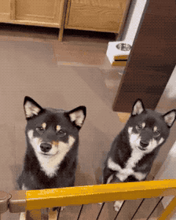

# About me

I'm Hiroki Tani. Pronouns: he/him  
I’m currently working as Designer Advocate on Figma.

- 🐦 [twitter.com/hiloki](https://twitter.com/hiloki)
- 🖊️ [zenn.dev/hiloki](https://zenn.dev/hiloki)
- 📓 [note.com/hiloki](https://note.com/hilokit)

## Projects

- [FLOCSS](https://github.com/hiloki/flocss)

## Publications

- [柴犬でもわかるFLOCSS](https://mamehiko.booth.pm/items/1033385)(PDF, 2018)
- [Web制作者のためのCSS設計の教科書](https://amzn.to/33jPrO8)(2014)

## My Doggoes

## Mediakit

- [Biography](profile.md#biography)
- [Images](profile.md#images)
