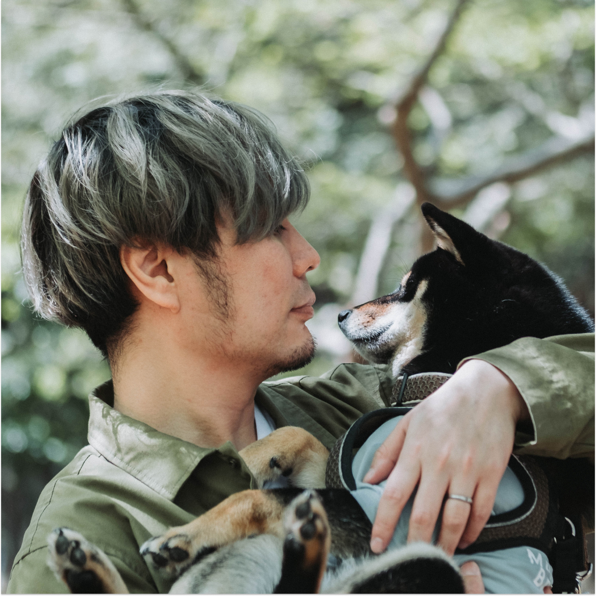
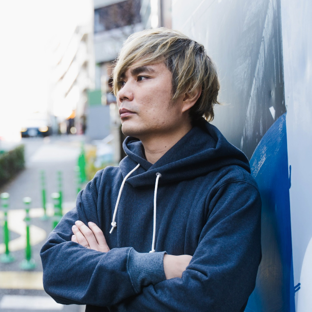

# Profile

## ~100字

Figma Japan株式会社デザイナーアドボケート。事業会社、フリーランス、起業やスタートアップでのデザイン・開発を経験し、現在はFigmaの普及活動やリソースの設計・開発に取り組んでいる。

## ~150字

Figma Japan株式会社デザイナーアドボケート。中小企業向けのSaaS、フリーランスでの受託、起業やスタートアップでの開発チーム立ち上げを経験。Webのフロントエンド開発や、UI・UX設計をおこなう。現在はFigmaの普及活動やリソースの設計・開発に取り組んでいる。

## ~200字

Figma Japan株式会社デザイナーアドボケート。中小企業向けのSaaS、フリーランスでの受託、起業やスタートアップでの開発チーム立ち上げを経験。Webのフロントエンド開発や、UI・UX設計をおこなう。現在はFigmaの普及活動やリソースの設計・開発に取り組んでいる。またデザインシステムに関連する情報のキュレーションや、その他講演・執筆活動などもおこなっている。

# Images

| Primary | Secondary |
| -------- | ------- |
|  |  | 
