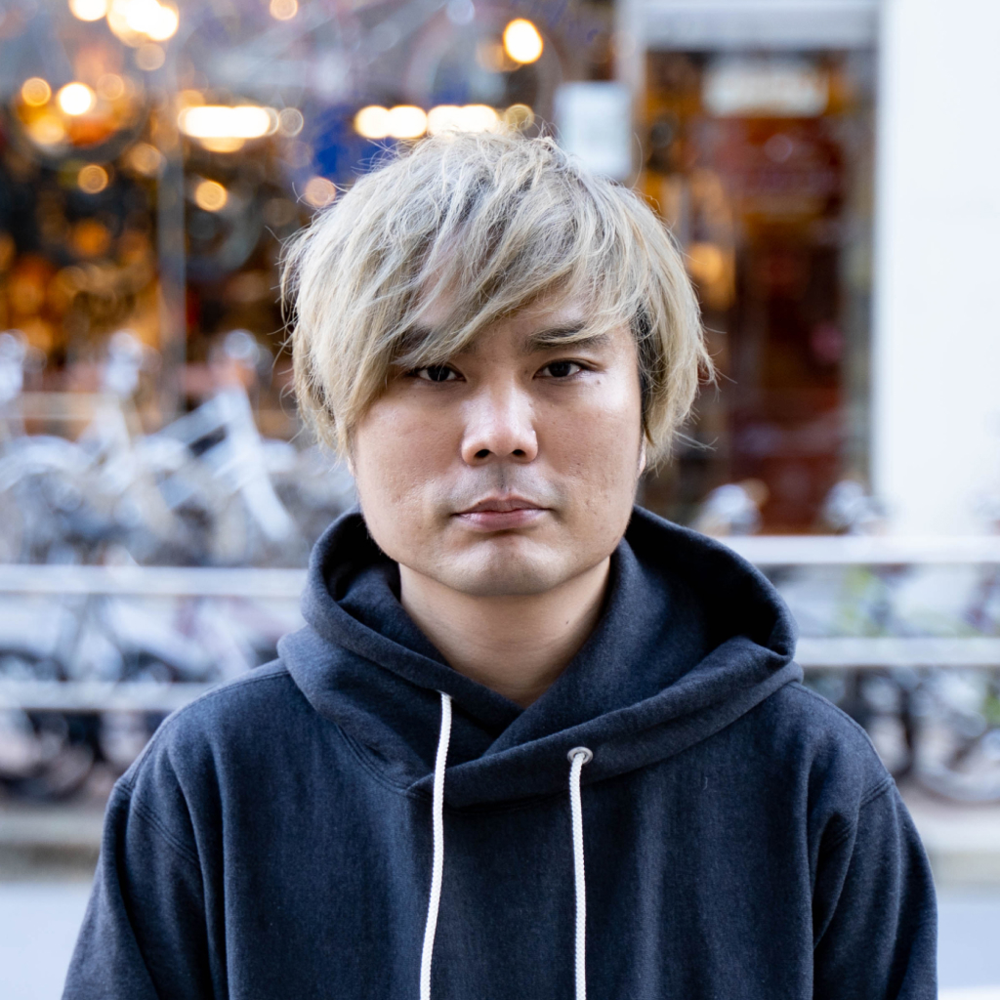

# Biography

## ~100字

事業会社、フリーランス、起業やスタートアップでのデザイン・開発経験多数。現在はユビー株式会社のデザインエンジニアとしてサービス開発、デザイン基盤開発に従事。

## ~150字

中小企業向けのSaaS、フリーランスでの受託、起業やスタートアップでの開発チーム立ち上げを経験。Webのフロントエンド開発や、UI設計・UX設計をおこなう。現在はユビー株式会社のデザインエンジニアとてサービス開発、デザイン基盤開発に従事。

## ~200字

中小企業向けのSaaS、フリーランスでの受託、起業やスタートアップでの開発チーム立ち上げを経験。Webのフロントエンド開発だけでなく、UI設計・UX設計をおこなう。現在はユビー株式会社のデザインエンジニアとてサービス開発、デザイン基盤開発に従事。その他講演活動、技術書の執筆もおこなう。代表著書『Web制作者のためのCSS設計の教科書』

# Images

| Primary | Secondary |
| -------- | ------- |
|  |  | 